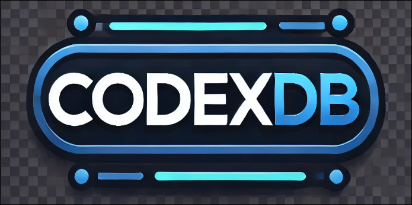
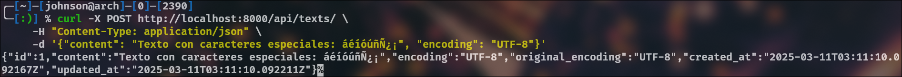
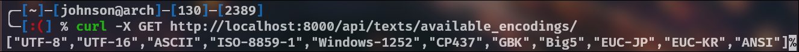
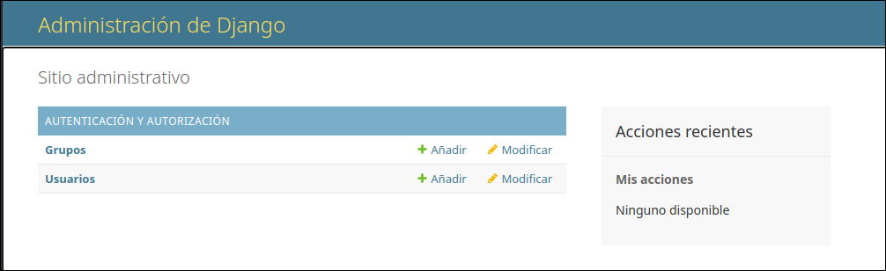

# CodexDB

<div align="center">
  
  <p><strong>Base de datos flexible para conversión de codificaciones en tiempo real</strong></p>
</div>

## 📋 Descripción

CodexDB es una base de datos flexible que permite almacenar y convertir datos entre diferentes codificaciones en tiempo real. Diseñada para desarrolladores que necesitan manejar múltiples formatos de caracteres sin perder información, CodexDB facilita la interoperabilidad entre sistemas con distintos estándares de codificación.

Esta API RESTful construida con Django y PostgreSQL resuelve el problema común de incompatibilidad entre diferentes sistemas de codificación (UTF-8, ANSI, ISO-8859-1, etc.) permitiendo la transformación dinámica de los datos según las necesidades del usuario.

## ✨ Características

- 🔄 **Conversión dinámica** entre múltiples estándares de codificación (UTF-8, ANSI, ISO-8859-1, Windows-1252, etc.)
- 🗄️ **Almacenamiento persistente** de datos con historial de codificaciones
- 🔍 **Validación de codificaciones** para prevenir errores
- 🚀 **API RESTful completa** para integración con cualquier sistema
- 🐳 **Contenedores Docker** para despliegue sencillo y consistente
- 📊 **Base de datos PostgreSQL** para almacenamiento robusto y fiable

## 🛠️ Tecnologías utilizadas

- Python 3.9+
- Django 4.2+
- Django REST Framework
- PostgreSQL 14
- Docker & Docker Compose

[](https://opensource.org/licenses/MIT)
[](https://www.python.org/downloads/)
[](https://www.djangoproject.com/)
[](https://www.postgresql.org/)
[](https://www.docker.com/)

## 📦 Instalación

### Requisitos previos

- Docker y Docker Compose
- Git

### Pasos de instalación

1. **Clonar el repositorio**:
   ```bash
   git clone https://github.com/Johnson1255/CodexDB.git
   cd CodexDB
   ```

2. **Crear archivo de variables de entorno**:
   ```bash
   # Crea un archivo .env con los siguientes contenidos
   
   # Clave secreta de Django
   SECRET_KEY=tu_clave_secreta_generada_aqui

   # Modo de depuración (True para desarrollo, False para producción)
   DEBUG=True
   
   # Configuración de base de datos
   DB_NAME=encoding_db        # Nombre de tu base de datos
   DB_USER=tu_usuario_db      # Nombre de usuario de PostgreSQL
   DB_PASSWORD=tu_contraseña  # Contraseña para el usuario de la base de datos
   DB_HOST=db                 # Nombre del servicio de base de datos en Docker
   DB_PORT=5432               # Puerto estándar de PostgreSQL
   ```

3. **Iniciar los contenedores Docker**:
   ```bash
   docker-compose up -d
   ```

4. **Aplicar migraciones**:
   ```bash
   docker-compose exec web python manage.py migrate
   ```

5. **Crear superusuario** (opcional):
   ```bash
   docker-compose exec web python manage.py createsuperuser
   ```

## 💻 Uso

Una vez en funcionamiento, puedes acceder a:

- **API**: http://localhost:8000/api/
- **Panel de administración Django**: http://localhost:8000/admin/

## 🔌 API Endpoints

| Método | Endpoint | Descripción |
|--------|----------|-------------|
| GET | `/api/texts/` | Listar todos los textos almacenados |
| POST | `/api/texts/` | Crear un nuevo texto |
| GET | `/api/texts/{id}/` | Obtener un texto específico |
| PUT | `/api/texts/{id}/` | Actualizar un texto existente |
| DELETE | `/api/texts/{id}/` | Eliminar un texto |
| POST | `/api/texts/{id}/convert/` | Convertir un texto a otra codificación |
| GET | `/api/texts/available_encodings/` | Listar codificaciones disponibles |
| POST | `/api/texts/validate_encoding/` | Validar una codificación específica |
| GET | `/api/schemas/` | Listar esquemas de codificación |
| POST | `/api/schemas/` | Crear un nuevo esquema de codificación |

### Ejemplos de uso

#### Crear un nuevo texto:
```bash
curl -X POST http://localhost:8000/api/texts/ \
  -H "Content-Type: application/json" \
  -d '{"content": "Texto de ejemplo con caracteres especiales: áéíóú", "encoding": "UTF-8"}'
```

#### Convertir un texto a otra codificación:
```bash
curl -X POST http://localhost:8000/api/texts/1/convert/ \
  -H "Content-Type: application/json" \
  -d '{"target_encoding": "ISO-8859-1"}'
```

#### Obtener las codificaciones disponibles:
```bash
curl -X GET http://localhost:8000/api/texts/available_encodings/
```

## 📊 Resultados y Capturas

A continuación se muestran algunas capturas de las pruebas realizadas con CodexDB.

### Almacenamiento de texto en UTF-8


### Conversión de UTF-8 a ISO-8859-1


### Manejo de caracteres especiales


### Panel de administración


## 🧪 Casos de uso

- **Sistemas de legado**: Integración con sistemas antiguos que utilizan codificaciones obsoletas.
- **Internacionalización**: Manejo de textos en múltiples idiomas con diferentes requisitos de codificación.
- **Migración de datos**: Facilita la conversión de datos durante migraciones entre sistemas con estándares diferentes.
- **Análisis de texto**: Preprocesamiento de datos textuales para análisis o minería de datos.

### 🛡️ Notas de Seguridad

- **Nunca** compartas tu archivo `.env`
- Añade `.env` a tu `.gitignore`
- Usa contraseñas seguras y únicas
- En producción, establece `DEBUG=False`

## 📚 Estructura del proyecto

```
codexdb/
├── docker-compose.yml
├── Dockerfile
├── requirements.txt
├── .gitignore
├── README.md
├── encoding_api/           # Configuración principal de Django
│   ├── __init__.py
│   ├── settings.py
│   ├── urls.py
│   ├── wsgi.py
│   └── asgi.py
├── api/                    # Aplicación de la API
│   ├── __init__.py
│   ├── models.py           # Modelos de datos
│   ├── serializers.py      # Serializadores para la API
│   ├── views.py            # Vistas y lógica de la API
│   ├── urls.py             # Rutas de la API
│   ├── admin.py            # Configuración del panel admin
│   ├── apps.py
│   ├── migrations/
│   └── utils/              # Utilidades
│       ├── __init__.py
│       └── encoding.py     # Funciones de conversión de codificación
├── docs/                   # Documentación y capturas
└── manage.py
```

## 📄 Licencia

Este proyecto está licenciado bajo la Licencia MIT - consulta el archivo [LICENSE](LICENSE) para más detalles.

## 🎉 Imagen del día
 
 <p align="center">
   
 </p>


